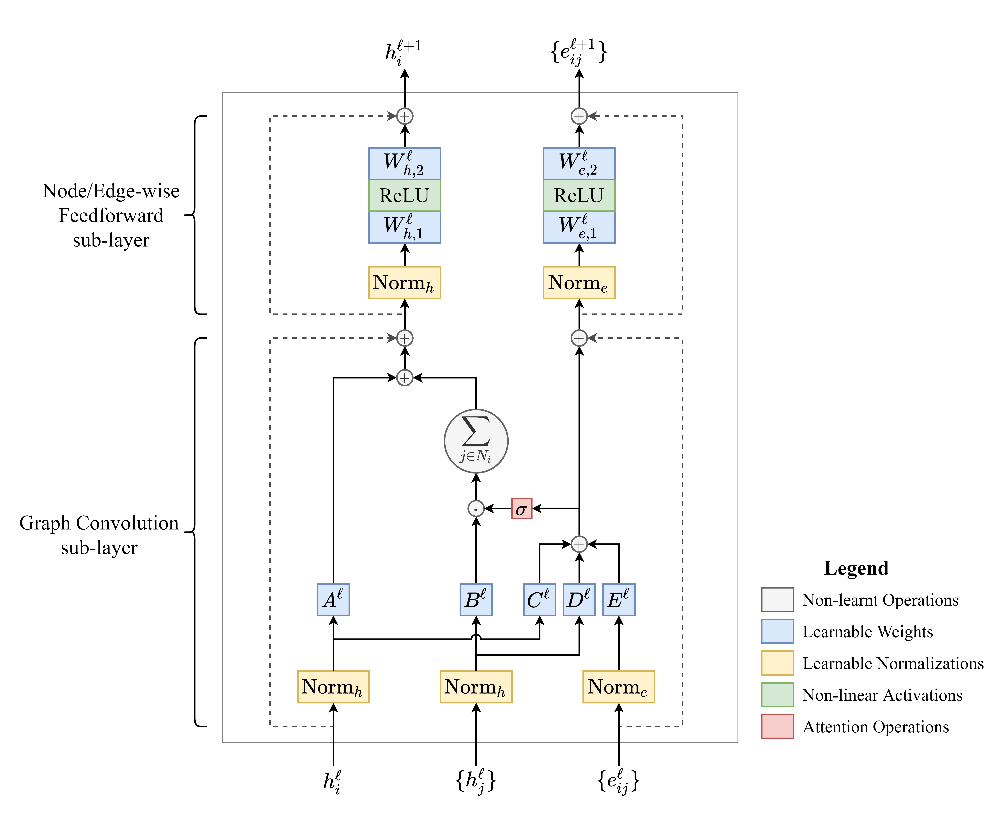

# :rocket: Gated Graph Transformers

>**Gated Graph Transformers** for graph-level property prediction, *i.e.* graph classification and regression.
>Blogpost: [*Transformers are Graph Neural Networks*](https://thegradient.pub/transformers-are-graph-neural-networks/), by [Chaitanya K. Joshi](http://www.chaitjo.com/), published with [*The Gradient*](https://thegradient.pub/).

This repository is my attempt to build intuitions about and track progress in **Graph Representation Learning** research. 
I aim to develop the most universal and powerful model which unifies state-of-the-art ideas and architectures from **Graph Neural Networks** and **Transformers**, without incorporating domain-specific tricks.



## Key Architectural Ideas

- :robot: **Deep, Residual Transformer Backbone** 
  - As the backbone architecture, I borrow the [two-sub-layered, pre-normalization variant](https://arxiv.org/abs/2002.04745) of Transformer encoders that has emerged as the standard in the NLP community, e.g. [GPT-3](https://arxiv.org/abs/2005.14165). Each Transformer block consists of a **message-passing sub-layer** followed by a **node-wise feedforward sub-layer**. The graph convolution is described later. 
  - The feedforward sub-layer projects node embeddings to an *absurdly* large dimension, passes them through a non-linear activation function, does dropout, and reduces back to the original embedding dimension.
  - The Transformer backbone enables training very **deep** and extremely **overparameterized** models. Overparameterization is [important for performance in NLP](https://arxiv.org/abs/1910.10683) and other combinatorially large domains, but was previously not possible for GNNs trained on small graph classifcation datasets. Coupled with unique node positional encodings (described later) and the feedforward sub-layer, overparameterization ensures that our GNN is **Turing Universal** (based on A. Loukas's recent insightful work, including [this paper](https://arxiv.org/abs/1907.03199)).

- :envelope: **Anisotropic Graph Convolutions** 
  - As the graph convolution layer, I use the [**Gated Graph Convolution**](https://arxiv.org/abs/1711.07553) with **dense attention mechanism**, which we found to be the best performing graph convolution in [Benchmarking GNNs](https://arxiv.org/abs/2003.00982).
  - Intuitively, Gated GraphConv [generalizes directional CNN filters](https://arxiv.org/abs/1905.01289) for 2D images to arbitrary graphs by learning a **weighted aggregations over the local neighbors** of each node. It upgrades the node-to-node attention mechanism from [GATs](https://arxiv.org/abs/1710.10903) and [MoNet](https://arxiv.org/abs/1611.08402) (i.e. one attention weight per node pair) to consider dense feature-to-feature attention (i.e. *d* attention weights for pairs of *d*-dimensional node embeddings). This graph convolution was originally proposed as [a sentence encoder for NLP](https://arxiv.org/abs/1703.04826) and further developed at NTU for [molecule generation](https://arxiv.org/abs/1906.03412) and [combinatorial optimization](https://arxiv.org/abs/1906.01227).
  - Another intuitive motivation for the Gated GraphConv is as a **learnable directional diffusion process** over the graph, or as a **coupled PDE over node and edge features** in the graph. Gated GraphConv makes the diffusion process/neighborhood aggregation anisotropic or directional, **countering [oversmoothing/oversquashing](https://arxiv.org/abs/2006.05205)** of features and enabling deeper models.
  - I am evidently partial to this graph convlution layer. At the same time, it is worth noting that anisotropic local aggregations and generalizations of directed CNN filters have demonstrated strong performance across a myriad of applications, including [**3D point clouds**](https://arxiv.org/abs/1904.07601), [drug discovery](https://pubs.acs.org/doi/abs/10.1021/acs.jcim.9b00237), [**material science**](https://openreview.net/forum?id=K3qa-sMHpQX), and [programming languages](https://arxiv.org/abs/1906.12192).

- :arrows_counterclockwise: **Graph Positional Encodings** 
  - I use the top-*k* non-trivial **Laplacian Eigenvectors** as unique node identifiers to inject structural/positional priors into the Transformer backbone. Laplacian Eigenvectors are a generalization of sinusoidal positional encodings from the original Transformers, and were concurrently proposed in the Benchmarking GNNs, [EigenGNNs](https://arxiv.org/abs/2006.04330), and [GCC](https://arxiv.org/abs/2006.09963) papers.
  - Randomly flipping the sign of Laplacian Eigenvectors during training (due to symmetry) can be seen as an additional **data augmentation** or **regularization technique**, helping delay overfitting to training patterns. Going further, the [Directional Graph Networks](https://arxiv.org/abs/2010.02863) paper presents a more principled approach for using Laplacian Eigenvectors.

---

Some ideas still in the pipeline include:

- **Graph-specific Normalization** - Originally motivated in Benchmarking GNNs as 'graph size normalization', there have been several subsequent graph-specific normalization techniques such as [GraphNorm](https://arxiv.org/abs/2009.03294) and [MessageNorm](https://arxiv.org/abs/2006.07739), aiming to replace or augment standard Batch Normalization. Intuitively, there is room for improvement as BatchNorm flattens mini-batches of graphs instead of accounting for the underlying graph structure.

- **Theoretically Expressive Aggregation** - There are several exciting ideas aiming to bridge the gap between theoretical expressive power, computational feasability, and generalization capacity for GNNs: [PNA-style](https://arxiv.org/abs/2004.05718) multi-head aggregation and scaling, generalized aggreagators from [DeeperGCNs](https://arxiv.org/abs/2006.07739), pre-computing structural motifs as in [GSN](https://arxiv.org/abs/2006.09252), etc.

- **Virtual Node and Low Rank Global Attention** - After the message-passing step, the [virtual node trick](https://arxiv.org/abs/1905.12265) adds messages to-and-fro a virtual/super node connected to all graph nodes. [LRGA](https://arxiv.org/abs/2006.07846) comes with additional theretical motivations but does something similar. Intuitively, these techniques enable modelling long range or latent interactions in graphs and counter the oversquashing problem with deeper networks.

- **General Purpose Pre-training** - It isn't truly a Transformer unless its pre-trained on hundreds of GPUs for thousands of hours...but general purpose pre-training for graph representation learning remains an open question!

## Installation and Usage
```bash
# Create new Anaconda environment
conda create -n new-env python=3.7
conda activate new-env
# Install PyTorch 1.6 for CUDA 10.x
conda install pytorch=1.6 cudatoolkit=10.x -c pytorch
# Install DGL for CUDA 10.x
conda install -c dglteam dgl-cuda10.x
# Install other dependencies
conda install tqdm scikit-learn pandas urllib3 tensorboard
pip install -U ogb

# Train GNNs on ogbg-mol* datasets
python main_mol.py --dataset [ogbg-molhiv/ogbg-molpcba] --gnn [gated-gcn/gcn/mlp]

# Prepare submission for OGB leaderboards
bash scripts/ogbg-mol*.sh

# Collate results for submission
python submit.py --dataset [ogbg-molhiv/ogbg-molpcba] --expt [path-to-logs]
```

Note: The code was tested on Ubuntu 16.04, using Python 3.6, PyTorch 1.6 and CUDA 10.1.

## Citation
```
@article{joshi2020transformers,
author = {Joshi, Chaitanya},
title = {Transformers are Graph Neural Networks},
journal = {The Gradient},
year = {2020},
howpublished = {\url{https://thegradient.pub/transformers-are-gaph-neural-networks/ } },
}
```